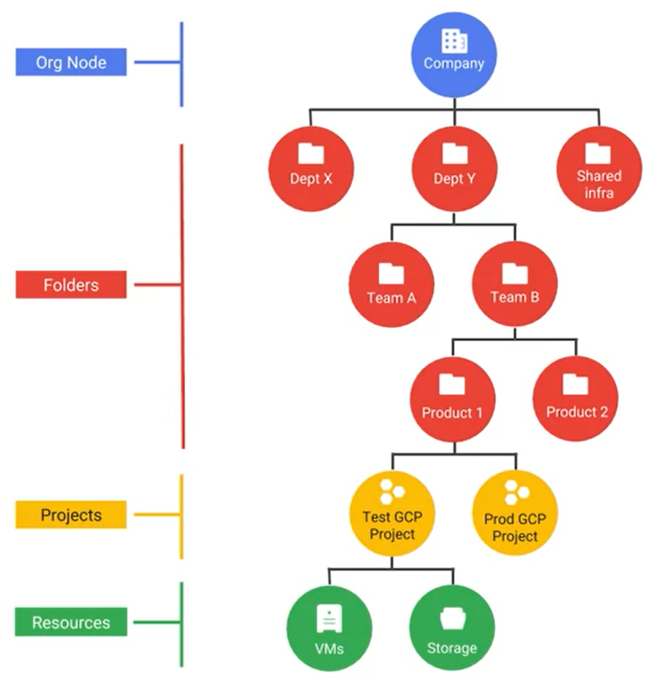

# Resource hierarchy levels define trust boundaries

- Group your resources according to your organization structure
- Levels of the hierarchy provide trust boundaries and resource isolation

# All GCP services you use are associated with a project

- Track resource and quota usage
- Enabling billing
- Manage permissions and credentials
- Enable services and APIs

# Project have three indentifying attributes

- Project ID
    - Globally uninque
    - Chosen by you
    - Immutable

- Project name
    - Need not be unique
    - Chosen by you
    - Mutable

- Project number
    - Globally unique
    - Assigned by GCP
    - Immutable

# Folders offer flexible management

- Folders group projects under an organization
- Folders can contain projcts, other folders, or both
- Use folders to assign policies

# An example IAM resource hierarchy

- A policy is set on a resource
    - Each policy contains a set of roles and role members

- Resources inherit policies from parent
    - Resource policies are a union of parent and resource

- A less restrictive parent policy overrides a more restricctive resource policy

