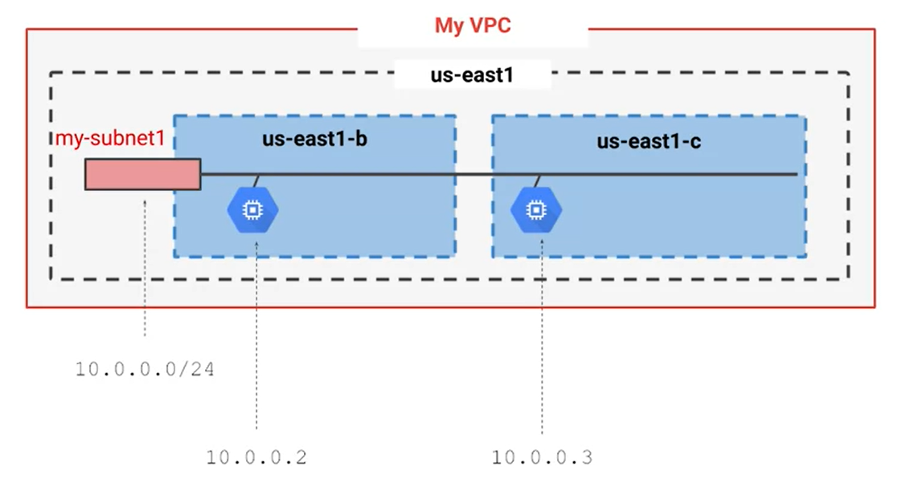

# Virtual Private CloudNetworking

- Each VPC network is contained in GCP project
- You can provision Cloud Platform resources, connect them to each other, and isolate them from one another

# Google Cloud VPC networks are global; subnets are regional

