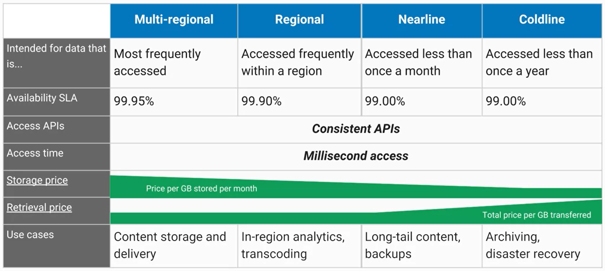

# Choosing among Cloud Storage classes

# Thre are several ways to bring data into Cloud Storage

- Online transfer
    - Self-managed copies using command-line tools  or drag-and-drop

- Storage Transfer Service
    - Scheduled, managed batch transfers

- Transfer Applicance (Beta)
    - Rackable appliances to securely ship your data

# Cloud Storage works with other GCP services

- BigQuery
    - Import and export tables

- App Engine
    - Object storage, logs, and Datastore backups

- Compute Engine
    - Startup scripts, images, and general object storage

- Cloud SQL
    - Import and export tables
